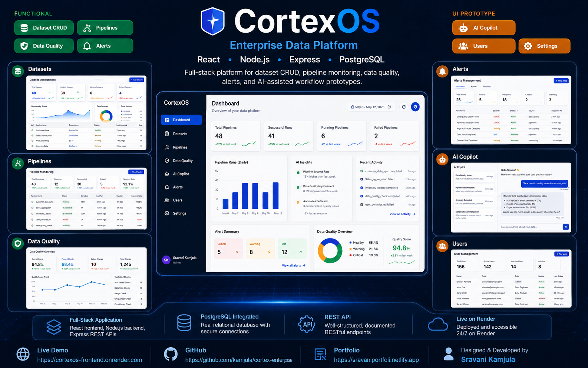
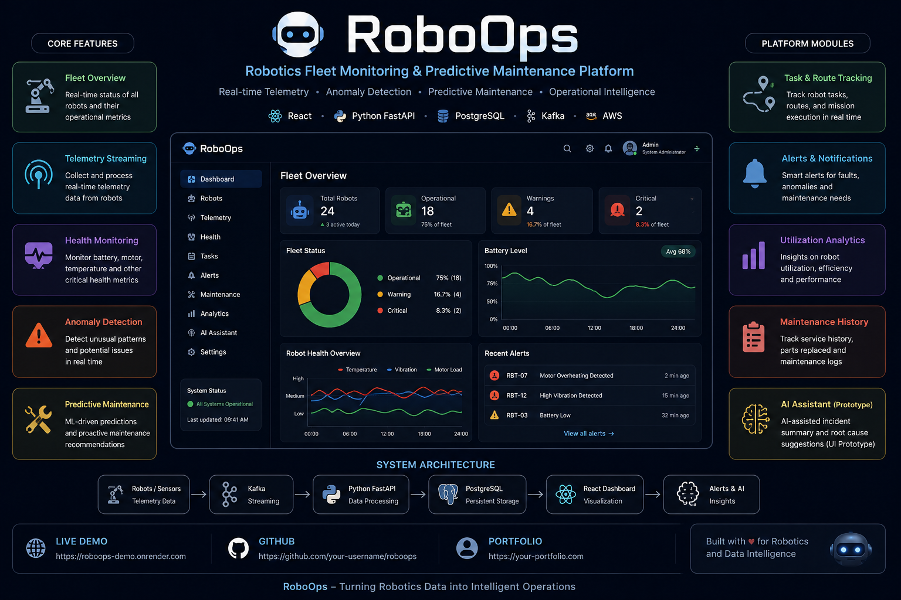

<div align="center">
  

  # Sravani Kamjula

  **Data Scientist | Data Engineer | AI/ML Engineer | Full-Stack Data Engineer**

  Building data platforms, analytics systems, machine-learning workflows, and full-stack data applications.

  🟢 Open to Data Scientist, Data Engineer, AI/ML Engineer, Analytics Engineer, Data Quality, and Full-Stack Data Engineer opportunities

  📍 United States
</div>

<br/>

<div align="center">

[](https://sravaniportfoli.netlify.app/)
[](https://www.linkedin.com/in/sravani-kamjula-763285176)
[](mailto:sravanikamjula@gmail.com)
[](https://github.com/kamjula)
[](https://www.kaggle.com/sravanikamjula)
[](https://x.com/KamjulaSravani)
[](https://www.upwork.com/freelancers/~01eeddf9788df2cd20)
[](https://cortexos-frontend.onrender.com)
[](https://github.com/kamjula/cortex-enterprise)

</div>

---

<table>
<tr>
<td valign="top" width="33%">

### 🔗 Connect

- [LinkedIn](https://www.linkedin.com/in/sravani-kamjula-763285176)
- [Portfolio](https://sravaniportfoli.netlify.app/)
- [Email](mailto:sravanikamjula@gmail.com)
- [Kaggle](https://www.kaggle.com/sravanikamjula)
- [X](https://x.com/KamjulaSravani)
- [Upwork](https://www.upwork.com/freelancers/~01eeddf9788df2cd20)

</td>
<td valign="top" width="33%">

### 📜 Anthropic Certifications

- [Building with the Claude API](https://verify.skilljar.com/c/mhg9boh2eiih)
- [Claude Code 101](https://verify.skilljar.com/c/s9bzgmf36ddp)
- [AI Fluency: Framework & Foundations](https://verify.skilljar.com/c/dh8oxakx2o53)

</td>
<td valign="top" width="33%">

### 🚀 Featured Project

- [CortexOS Live Demo](https://cortexos-frontend.onrender.com)
- [CortexOS Source Code](https://github.com/kamjula/cortex-enterprise)
- [Portfolio](https://sravaniportfoli.netlify.app/)

</td>
</tr>
</table>

---

## 🚀 Flagship Project — CortexOS — Enterprise Data Operations Platform

A deployed full-stack platform for dataset management, pipeline monitoring, data-quality workflows, operational alerts, and AI-assisted interface prototypes.

<div align="center">
  <a href="https://cortexos-frontend.onrender.com">
    
  </a>
</div>

<div align="center">

[](https://cortexos-frontend.onrender.com)
[](https://github.com/kamjula/cortex-enterprise)
[](https://sravaniportfoli.netlify.app/)

</div>

### ✅ Functional Modules — Connected to PostgreSQL and Express REST API

- Dataset management with PostgreSQL-backed CRUD
- Pipeline monitoring
- Pipeline trigger and retry workflows
- Execution logs
- Data-quality metrics and validation views
- Alert creation, update, resolution, and deletion
- Express REST API integration
- Frontend and backend deployment on Render

### 🧪 UI Prototypes — Not Connected to a Live Backend

- AI Copilot
- User Management
- Settings

> Authentication and role-based access control are not yet implemented.

### CortexOS Tech Stack


---

## 🤖 Future Project — RoboOps

### Robotics Fleet Monitoring & Predictive Maintenance Platform

<div align="center">
  
</div>

> **Status: Planning & Architecture Phase**  
> The image above is a concept preview representing the intended product direction. The project has not yet been fully implemented.

RoboOps is a planned enterprise robotics operations platform focused on robot fleet monitoring, telemetry analysis, anomaly detection, predictive maintenance, and operational intelligence.

### Planned Capabilities

- Robot fleet overview and operational status
- Real-time telemetry monitoring
- Battery, temperature, vibration, and motor-health tracking
- Fault and anomaly detection
- Predictive maintenance workflows
- Task and route tracking
- Maintenance history
- Utilization analytics
- Operational alerts and notifications
- AI-assisted incident-summary prototype

### Planned Technology Stack

**Frontend:** React, JavaScript, Recharts  
**Backend:** Python, FastAPI  
**Database:** PostgreSQL  
**Streaming:** Apache Kafka  
**Cloud:** AWS S3, EC2, RDS  
**Analytics:** Python, Pandas, Scikit-learn  
**Development:** Git, GitHub, VS Code

### Planned Architecture

```text
Robots / Simulated Sensors
          ↓
     Kafka Streaming
          ↓
     Python FastAPI
          ↓
       PostgreSQL
          ↓
     React Dashboard
          ↓
Alerts & Operational Insights
```

> Features and technologies listed above represent the intended roadmap and have not yet been fully implemented.

---

## 📊 Selected Impact

| Area | Result |
|---|---|
| EDI Operations | Supported 50K+ transactions across multiple trading partners |
| Reporting Automation | Reduced monthly reporting effort by 30% |
| SQL Automation | Automated 6 recurring SQL reports |
| ETL Validation | Validated 10+ ETL workflows with full reconciliation |
| Process Efficiency | Saved approximately 8 hours per week through automation |

---

## 🛠️ Tech Stack & Expertise

### Analytics


### Data Science & Machine Learning


### Data Engineering


### Application Development


### Data Quality


### EDI


---

## 📜 Certifications — Anthropic

| Certification | Issuer | Completion Date | Credential |
|---|---|---|---|
| Building with the Claude API | Anthropic | June 15, 2026 | [View Credential](https://verify.skilljar.com/c/mhg9boh2eiih) |
| Claude Code 101 | Anthropic | June 13, 2026 | [View Credential](https://verify.skilljar.com/c/s9bzgmf36ddp) |
| AI Fluency: Framework & Foundations | Anthropic | June 12, 2026 | [View Credential](https://verify.skilljar.com/c/dh8oxakx2o53) |

---

## 📂 Additional Projects

| Project | Purpose | Stack | Repository |
|---|---|---|---|
| 🛡️ Healthcare Fraud Detection | Detects potentially fraudulent medical claims using rule-based anomaly detection | Python, SQL, Pandas | [Repo](https://github.com/kamjula/healthcare-fraud-detection) |
| 🔍 Enterprise Data Detective | Profiles enterprise data and flags suspicious transactions with plain-language exploration | Python, SQL, DuckDB, Streamlit | [Repo](https://github.com/kamjula/enterprise-data-detective) |
| 🔧 Self-Healing Data Pipeline | Detects and resolves missing values, schema drift, and duplicates without manual work | Python, SQL | [Repo](https://github.com/kamjula/Self-Healing-Data-Pipeline) |
| 🛒 E-Commerce Sales Analysis | End-to-end EDA covering regional trends, category performance, and business insights | Python, SQL, Tableau | [Repo](https://github.com/kamjula/Ecommerce-sales-analysis) |
| ☁️ Amazon Data Analyst Prep | SQL, Python, and Tableau practice plan for data analyst interview preparation | SQL, Python, Tableau | [Repo](https://github.com/kamjula/Amazon-data-analyst-prep) |

---

## 📈 GitHub Activity

<div align="center">


</div>

---

## ☕ Support My Work

If you find my open-source projects useful, you can support future development of CortexOS and other practical data projects.

[](https://buymeacoffee.com/sravanikamc)

---

## 📬 Contact

<div align="center">

[](https://sravaniportfoli.netlify.app/)
[](https://www.linkedin.com/in/sravani-kamjula-763285176)
[](mailto:sravanikamjula@gmail.com)
[](https://www.kaggle.com/sravanikamjula)
[](https://x.com/KamjulaSravani)
[](https://github.com/kamjula)
[](https://www.upwork.com/freelancers/~01eeddf9788df2cd20)
[](https://buymeacoffee.com/sravanikamc)

</div>
