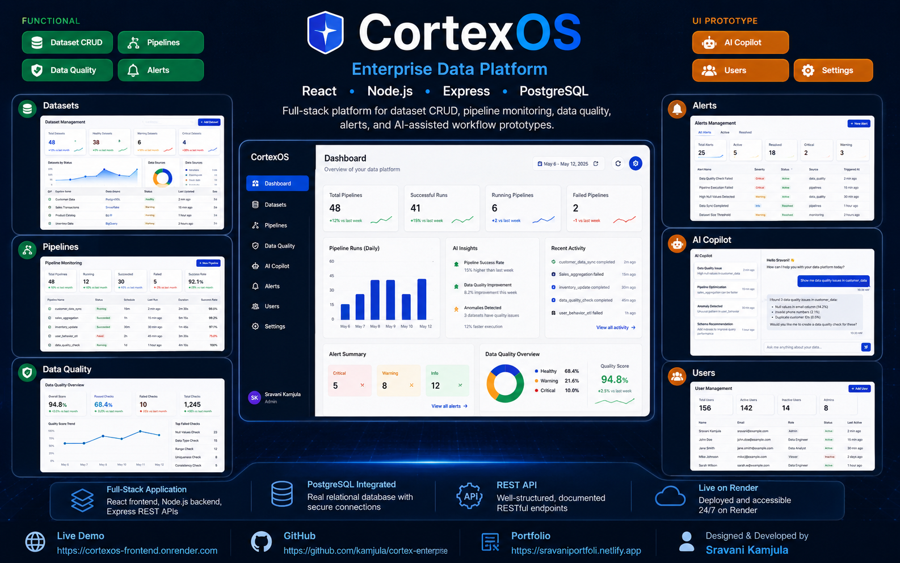
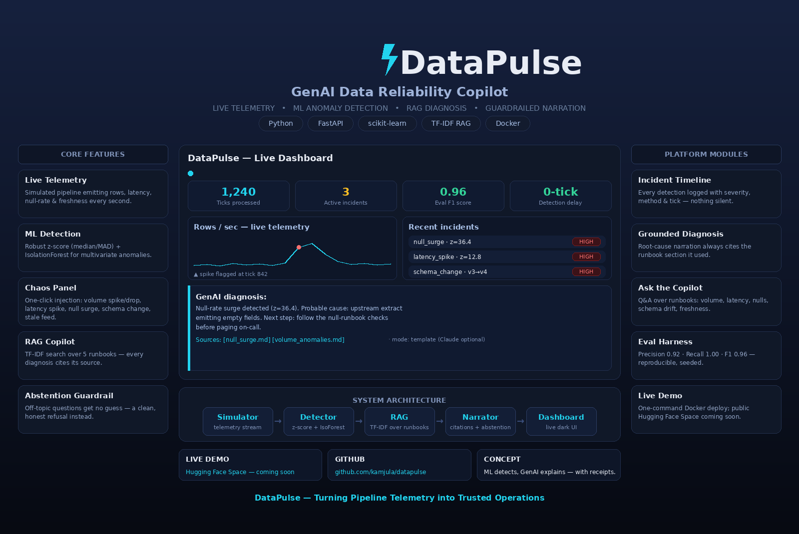

# Sravani Kamjula

**Data Analyst | Data Scientist | Data Engineer | Analytics Engineer | AI/ML Engineer | Full-Stack Data Engineer**

Building data platforms, analytics systems, machine-learning workflows, and full-stack data applications.

🟢 Open to Data Analyst, Data Scientist, Data Engineer, AI/ML Engineer, Analytics Engineer, Data Quality, and Full-Stack Data Engineer opportunities.

📍 United States

---

## ⚡ Quick Highlights

- CortexOS — Full-stack data platform built with React, Node.js, Express, and PostgreSQL featuring pipeline monitoring, data quality workflows, and alerting.

- DataPulse — GenAI data reliability copilot: ML anomaly detection (robust z-score + IsolationForest) over live pipeline telemetry, RAG runbook diagnosis with citations, shipped incrementally via daily PRs.

- Professional Experience — Built SQL reports, supported ETL workflows, and developed data analytics solutions using Python and SQL.

- Portfolio — 6+ projects spanning AI, data engineering, fraud detection, self-healing pipelines, and end-to-end analytics.

- [RoboOps](https://github.com/kamjula/roboops-platform) — Full-stack robotics fleet condition-analytics demo built with React, FastAPI, and PostgreSQL. Includes synthetic telemetry, read-only viewer access, trend/anomaly signals, and Kafka/Redpanda + DLQ workflows verified locally and in CI; signals are not validated failure predictions. [Live demo](https://roboops-platform.vercel.app/).

- AI Skills — Experience with Claude API, OpenAI, LLM applications, and modern AI development workflows.

📌 Pinned repositories above showcase the code. Scroll down for detailed project write-ups, technical stack, certifications, and experience.

---

## 🚀 Flagship Project — CortexOS — Enterprise Data Operations Platform

A deployed full-stack platform for dataset management, pipeline monitoring, data-quality workflows, operational alerts, and AI-assisted interface prototypes.

### ✅ Functional Modules — Connected to PostgreSQL and Express REST API

- Dataset management with PostgreSQL-backed CRUD
- Pipeline monitoring
- Pipeline trigger and retry workflows
- Execution logs
- Data-quality metrics and validation views
- Alert creation, update, resolution, and deletion
- Express REST API integration
- Frontend and backend deployment on Render

### 🧪 UI Prototypes — Not Connected to a Live Backend

- AI Copilot
- User Management
- Settings

*Note: Authentication and role-based access control are not yet implemented.*

### CortexOS Tech Stack

---

## 🤖 RoboOps — Robotics Fleet Monitoring & Condition Analytics

A deployed full-stack recruiter demo for monitoring a synthetic robotics fleet. The React/Vite frontend uses a FastAPI backend and PostgreSQL persistence.

- Explore the dashboard, robot inventory, telemetry, health signals, alerts, maintenance records, tasks, analytics, and a rule-based guided assistant.
- Telemetry workflows include idempotent HTTP ingestion and Kafka/Redpanda producer-consumer processing with DLQ handling; Kafka is verified locally and in CI, and is not a hosted-demo dependency.
- Health and analytics surfaces show rule-based and statistical condition/anomaly signals. They are not validated failure predictions or remaining-useful-life estimates.
- The public viewer uses synthetic data and read-only access. Hosted readings are generated examples, not real robot measurements.

[Repository](https://github.com/kamjula/roboops-platform) · [Live demo](https://roboops-platform.vercel.app/) · [Architecture](https://github.com/kamjula/roboops-platform/blob/main/docs/architecture.md) · [Recruiter tour](https://github.com/kamjula/roboops-platform/blob/main/docs/recruiter-demo.md)

---

## ⚡ DataPulse — GenAI Data Reliability Copilot

"ML detects, GenAI explains" — a data reliability copilot that watches pipeline telemetry, flags anomalies with machine learning, and explains root causes by citing runbook sources.

### ✅ What it does

- Live telemetry simulator emitting rows, latency, null-rate, and freshness every second
- ML anomaly detection — robust z-score (median/MAD) + IsolationForest for multivariate anomalies
- Chaos panel — one-click fault injection: volume spike/drop, latency spike, null surge, schema change, stale feed
- RAG copilot — TF-IDF search over runbooks; every diagnosis cites its source
- Abstention guardrail — off-topic questions get an honest refusal instead of a guess
- Eval harness — precision/recall/F1 on seeded scenarios (F1 0.96+), exit-code gated

### DataPulse Tech Stack

---

## 📊 Selected Impact

| Area | Result |
|---|---|
| EDI Operations | Supported 50K+ transactions across multiple trading partners |
| Reporting Automation | Reduced monthly reporting effort by 30% |
| SQL Automation | Automated 6 recurring SQL reports |
| ETL Validation | Validated 10+ ETL workflows with full reconciliation |
| Process Efficiency | Saved approximately 8 hours per week through automation |

---

## 🛠️ Tech Stack & Expertise

### Analytics

### Data Science & Machine Learning

### Data Engineering

### Application Development

### Data Quality

### EDI

---

## 📜 Certifications — Anthropic

| Certification | Issuer | Completed | Credential |
|---|---|---|---|
| Building with the Claude API | Anthropic | June 15, 2026 | [Verify](https://verify.skilljar.com/c/mhg9boh2eiih) |
| Claude Code 101 | Anthropic | June 13, 2026 | [Verify](https://verify.skilljar.com/c/s9bzgmf36ddp) |
| AI Fluency: Framework & Foundations | Anthropic | June 12, 2026 | [Verify](https://verify.skilljar.com/c/dh8oxakx2o53) |

---

## 📂 Additional Projects

| Project | Purpose | Stack | Repository |
|---|---|---|---|
| 🛡️ Healthcare Fraud Detection | Detects potentially fraudulent medical claims using rule-based anomaly detection | Python, SQL, Pandas | [Repo](https://github.com/kamjula/healthcare-fraud-detection) |
| 🔍 Enterprise Data Detective | Profiles enterprise data and flags suspicious transactions with plain-language exploration | Python, SQL, DuckDB, Streamlit | [Repo](https://github.com/kamjula/enterprise-data-detective) |
| 🔧 Self-Healing Data Pipeline | Detects and resolves missing values, schema drift, and duplicates without manual work | Python, SQL | [Repo](https://github.com/kamjula/Self-Healing-Data-Pipeline) |
| 🛒 E-Commerce Sales Analysis | End-to-end EDA covering regional trends, category performance, and business insights | Python, SQL, Tableau | [Repo](https://github.com/kamjula/Ecommerce-sales-analysis) |
| ☁️ Amazon Data Analyst Prep | SQL, Python, and Tableau practice plan for data analyst interview preparation | SQL, Python, Tableau | [Repo](https://github.com/kamjula/Amazon-data-analyst-prep) |

---

## 📈 GitHub Activity

  

  

  
*Note: GitHub Stats, Top Languages, Streak, and Trophy widgets are excluded because their third-party hosting services (Vercel/Heroku community deployments) are currently unavailable. They will be added once service is restored.*
  
---
  

**🟢 Open to Data Analyst, Data Scientist, Data Engineer, AI/ML Engineer, Analytics Engineer, Data Quality, and Full-Stack Data Engineer opportunities.**

